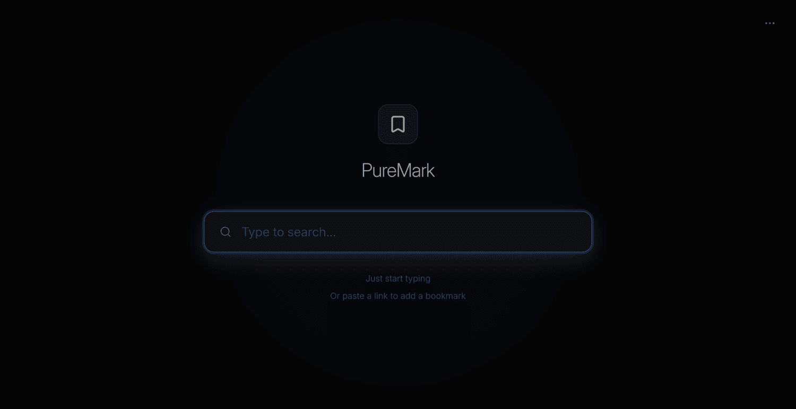
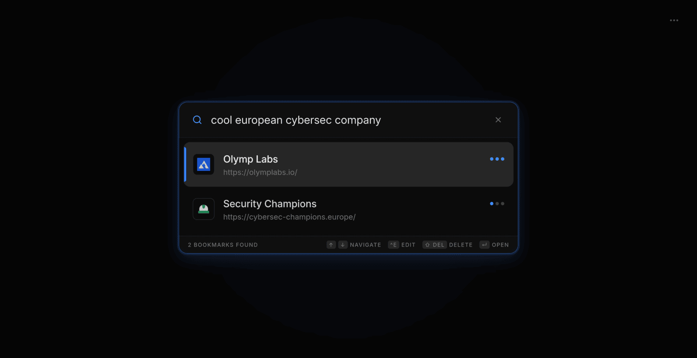
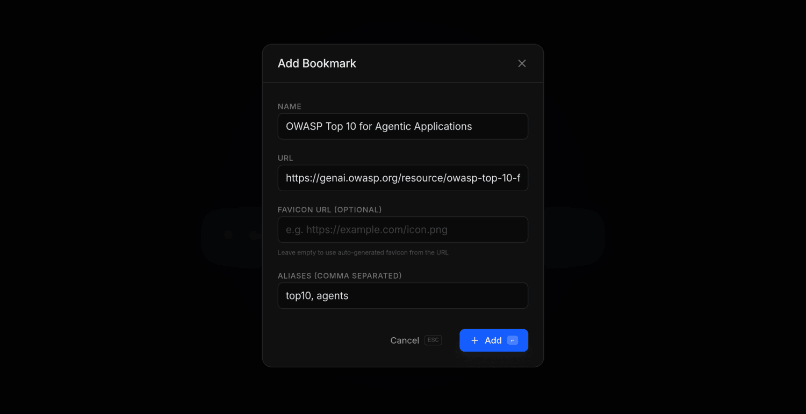

<h1 align="center">Puremark 🔖⚡</h1>

  
  

  Provided by 
  
  <a href="https://olymplabs.io/share/github-ref">Olymp Labs</a>

---
- [About this project](#about-this-project)
- [Features](#features)
- [License](#license)
---

## About this project

🫵 *Have you ever searched through your browser history or your bookmarks like a maniac, maybe even on different browsers and devices?*

👉 We got you. With *Puremark* you can search for the right bookmark blazingly fast by just typing and striking your `Enter ↵` key.

> [!IMPORTANT]  
> This project is gonna be released very soon  
> Setup instructions also coming very soon ;)

> [!TIP]
> Try out the demo at [demo-puremark.olymplabs.io](https://demo-puremark.olymplabs.io)

## Features

🔍 All-in-one search component (search, edit and delete using shortcuts)  
⚡ Reach your destination faster than ever before  
📋 Just paste any URL into Puremark to save it  
💾 Centralized persistence of all your important bookmarks across browsers and devices  
🎯 Automatic prioritization based on usage patterns  
🪶 No bloat, just a minimalistic web page  

---

  
  
  

## Star History

<picture>
  <source media="(prefers-color-scheme: dark)" srcset="https://proxy.cyb3rko.de/stars/svg?repos=olymp-labs/puremark&type=Date&theme=dark" />
  <source media="(prefers-color-scheme: light)" srcset="https://proxy.cyb3rko.de/stars/svg?repos=olymp-labs/puremark&type=Date&theme=light" />
  
</picture>

## License

    Copyright (C) 2026 Olymp Labs

    This program is free software: you can redistribute it and/or modify
    it under the terms of the GNU Affero General Public License as
    published by the Free Software Foundation, either version 3 of the
    License, or (at your option) any later version.

    This program is distributed in the hope that it will be useful,
    but WITHOUT ANY WARRANTY; without even the implied warranty of
    MERCHANTABILITY or FITNESS FOR A PARTICULAR PURPOSE.  See the
    GNU Affero General Public License for more details.

    You should have received a copy of the GNU Affero General Public License
    along with this program.  If not, see https://www.gnu.org/licenses/.
